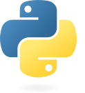

[{height=1.15em}](https://python.org "CPython Home Page")
[Python First](https://github.com/incusdata/py1st#python-first "GitHub — Incus Data / Python First") Wiki contains pages covering important Python topics. The order they could be read, depends on you requirements — each page is roughly chapter length. Towards the end of many pages, more advanced material may be discussed. Beginners can safely ignore advanced material in the short term — the content can be revisited when appropriate.

[idgh-pylogo-svg]:
   res/w-py-ico.svg
   "GitHub — Python Logo"
[idgh-py1st]:
   https://github.com/incusdata/py1st#python-first
   "GitHub — Incus Data / Python First"

<!-- &#x1F40D;&#x0031;&#xFE0F;&#x20E3; (&#x1F947;) -->

| &#x23FA; **LICENSE** — *Wiki Content* |
|:------------------------------------|
| The contents of this wiki, including images (unless otherwise stated), is licensed under the Creative Commons Attribution-NonCommercial 4.0 International ([CC BY-NC 4.0][ccbyncsa]) license. All source code, example snippets, and programs alike, excluding image sources, are licensed under the MIT No Attribution ([MIT-0][lic-mitzero]) license.

[ccbyncsa]:
   https://creativecommons.org/licenses/by-nc/4.0/
   "Creative Commons — Attribution-NonCommercial 4.0 International (CC BY-NC 4.0)"
[lic-mitzero]:
   https://opensource.org/license/mit-0/
   "Open Source Initiative — MIT No Attribution License"

# Things First

This wiki and associated [repository][idgh-py1st] contains several pages covering topics deemed appropriate for an introduction to the [Python 3][w-python] scripting language. Example [Python 3.14][p-v314] and [later][p-v315] code, will mostly be in the repository, while the wiki pages will contain references to them, and sometimes code extracts.

## Focus 

The primary focus of all this material, is Python language mastery, and writing *scripts*. No particular applications of Python are covered in any great depth. Python has its tail in too many pies to do them justice.

This wiki provides information for beginners to intermediate Python learners. 

[w-python]:
   https://en.wikipedia.org/wiki/Python_(programming_language)
   "Wikipedia — Python (Programming Language)"
[p-v314]:
   https://docs.python.org/3.14/
   "Python Docs — Python 3.14"
[p-v315]:
   https://docs.python.org/3.15/
   "Python Docs — Python 3.15"

## Prerequisites 

Before starting to learn Python, it is important to have the necessary tools and to set realistic expectations. However, as the age of AI-assisted programming and learning is dawning, you may be able to take a non-traditional approach — but that's your prerogative.

`     `{.ws}TL;DR:&nbsp;&nbsp; [os](#os) []{.rar} [terminal](#terminal) []{.rar} [shell](#shell) []{.rar} [python](#python) []{.rar} [you](#you)

### You

Theoretically it may be possible to learn a [programming language][w-prg-lang] without writing and running code, but that would be less than ideal, to say the least. Practice makes perfect and all that jazz.

Having some programming and/or scripting experience will be an advantage, but not strictly required. The same applies to [command-line][w-cmdline] competency.

[w-prg-lang]:
   https://en.wikipedia.org/wiki/Programming_language
   "Wikipedia — Programming Language"
[w-cmdline]:
   https://en.wikipedia.org/wiki/Command-line_interface
   "Wikipedia — Command-Line Interface"

### Python

To learn and use the [Python][w-python] language, a Python interpreter has to be installed. It should be available on [your PATH][py1st-w-path-path]. There are several [implementations][p-alt-impl] of the Python language, but this repository focuses solely on the reference implementation called CPython from its custodians at [**python.org**][python.org]. Alternative implementations are not covered.

[python.org]:
   https://python.org
   "Python.org — CPython Home Page"
[p-alt-impl]:
   https://www.python.org/download/alternatives/
   "Python — Alternative Implementions"
[py1st-w-path-path]:
   Your-PATH.md#path-variable
   "GitHub — Incus Data / Python First / Wiki / Your PATH # PATH Variable"

### Editor

Although any text editor will do, you should probably use a [code editor][w-code-editor]. If you have no particular preference, just use [VSCode][w-vscode]; it is [free][ms-vscode-dl] and has [good support][ms-vscode-python] for Python. Make sure **code** (the VSCode executable) is on [your PATH][py1st-w-path-path], for an easier life.

If you are using GitHub's [Codespaces][gh-codespaces], you can run VSCode in the browser, if you feel so inclined. Their ‘blank’ template has Python as well as a number of common third party packages installed, including [IPython][w-ipython].

[w-code-editor]:
   https://en.wikipedia.org/wiki/Source-code_editor
   "Wikipedia — Source-Code Editor"
[w-vscode]:
   https://en.wikipedia.org/wiki/Visual_Studio_Code
   "Wikipedia — Visual Studio Code"
[ms-vscode-dl]:
   https://code.visualstudio.com/Download
   "Microsoft — Download Visual Studio Code"
[ms-vscode-python]:
   https://code.visualstudio.com/docs/languages/python
   "Microsoft — VSCode / Python"
[gh-codespaces]:
   https://github.com/codespaces
   "GitHub — Codespaces"
[w-ipython]:
   https://en.wikipedia.org/wiki/IPython
   "Wikipedia — iPython"

### Shell

It is immaterial which operating system's [CLI][w-cli] (character-based interface or [**shell**][w-shell]) is used. However, examples include versions for [Unix-like shells][w-unix-shell] like [[bash]{.cc}][w-bash] and [[pwsh]{.cc} (PowerShell 7)][w-pwsh7]. The Windows Command Prompt ([cmd.exe]{.cc}) is not covered.

From the command-line, at minimum, you should be able to:

 * manage [your PATH][py1st-w-path-path], and other environment variables;
 * navigate & manage directories;
 * create, delete, rename files;
 * edit Python files (scripts); and
 * execute (run) Python files (programs/scripts).

[w-cli]:
   https://en.wikipedia.org/wiki/Command-line_interface
   "Wikipedia — Command-Line Interface"
[w-shell]:
   https://en.wikipedia.org/wiki/Shell_(computing)
   "Wikipedia — Shell (computing)"
[w-unix-shell]:
   https://en.wikipedia.org/wiki/Shell_(computing)
   "Wikipedia — Unix Shell"
[w-bash]:
   https://en.wikipedia.org/wiki/Bash_(Unix_shell)
   "Wikipedia — Bash (Unix Shell)"
[w-zsh]:
   https://en.wikipedia.org/wiki/Z_shell
   "Wikipedia — Z Shell (Zsh)"
[w-ksh]:
   https://en.wikipedia.org/wiki/KornShell
   "Wikipedia — KornShell"
[w-pwsh7]:
   https://en.wikipedia.org/wiki/PowerShell#PowerShell_7
   "Wikipedia — PowerShell # PowerShell 7"

### Terminal

For a smooth experience and maximum pleasure, may we recommend at minimum a 256-colour [terminal emulator][w-term-emu], e.g., [**xterm**][w-xterm], [GNOME Terminal][w-gnome-term], [Konsole][w-konsole]; or third party. Modern examples include [iTerm2][iterm] (macOS only), [WezTerm][wezterm], [Kitty][kitty], [Alacritty][critty], and more.

On Windows, you will be well-served by [Windows Terminal][w-wt] (**wt.exe**), though there are perfectly capable, and arguably better, third party terminal emulators available. The venerable [PuTTY][putty] is still viable; plus: WezTerm & Alacritty also run on Windows. The Windows Console (given relatively recent improvements) may work, but is not optimal.

[w-term-emu]:
   https://en.wikipedia.org/wiki/Terminal_emulator
   "Wikipedia — Terminal Emulator"
[w-xterm]:
   https://en.wikipedia.org/wiki/Xterm
   "Wikipedia — xterm"
[w-gnome-term]:
   https://en.wikipedia.org/wiki/GNOME_Terminal
   "Wikipedia — GNOME Terminal"
[w-wt]:
   https://en.wikipedia.org/wiki/Windows_Terminal
   "Wikipedia — Windows Terminal"
[w-konsole]:
   https://en.wikipedia.org/wiki/Konsole
   "Wikipedia — Konsole"
[iterm]:
   https://iterm2.com/
   "iTerm2 — Home Page"
[wezterm]:
   https://wezfurlong.org/wezterm/
   "WezTerm — Home Page"
[kitty]:
   https://sw.kovidgoyal.net/kitty/
   "Kitty — Home Page"
[critty]:
   https://alacritty.org/
   "Alacritty — Home Page"
[putty]:
   https://www.chiark.greenend.org.uk/~sgtatham/putty/
   "PuTTY — Home Page"

### OS

Any operating system supported by Python. When operating system specifics come up, we cover Linux, macOS, and Windows 11. [WSL][w-wsl] (Windows Subsystem for Linux) *is* Linux, so that will do as well.

[w-wsl]:
   https://en.wikipedia.org/wiki/Windows_Subsystem_for_Linux
   "Wikipedia — Windows Subsystem for Linux"

# Conventions

We use some arguably ‘unusual’ conventions and Unicode characters.

## Typographical Conventions

Syntax elements are enclosed in single left & right angle quotation marks (French *guillemets*): […]{.stx} (U+2039 & U+203A). As an example: [ident]{.stx} is a syntax specifier that means *identifier* or *name*, and [expr]{.stx} means *expression*. With that in hand, we can generalise the definition of a variable in Python:

&nbsp;&nbsp;&nbsp;&nbsp; [ident]{.stx} `=` [expr]{.stx}

It can also appear as follows when we think it is more readable:

&nbsp;&nbsp;&nbsp;&nbsp; `‹ident› = ‹expr›`

But they will still be referenced in running text as [ident]{.stx}ifier and [expr]{.stx}ession. Either way, text between guillemets ([··]{.stx}) are *descriptions* — you'll never type the text or guillemets.

A few characters or symbols are used as shorthand for common terms:

 * []{.dra} &nbsp; is shorthand for: ‘is defined in terms of’ or ‘has the following meaning’ or ‘is composed of the following’ (the context should make it clear).
 * [t]{.tra} &nbsp; is shorthand for: ‘has the following type’.
 * []{.alt} &nbsp; means ‘alternative’ or ‘or’.
 * []{.eqv} &nbsp; is shorthand for: ‘equivalent to’.


## Scripts & Snippets

A complete Python script will always start with the following [shebang][w-shebang] (or *hash-bang*):

&nbsp;&nbsp;&nbsp;&nbsp; `#/usr/bin/env python3`

Here is an example [[hyby.py]{.cc}][src-simple-hyby.py] (“high buy period pie”) complete script:

##### [`hyby.py`][src-simple-hyby.py] — Simple Python ‘Hello’ Script {.file}
```{.py}
#!/usr/bin/env python3
"""Hello/Goodbye, World Example"""

print("Hello, World!")
print("Goodbye.")
```

Code snippets (partial code), will not have a shebang line. If a code extract represents lines that belong to a larger body of code, then we will indicate that with `···`.

###### `py` — First print statement {.snip}
```{.py}
···
print("Hello, World!")                #← from `hyby.py`(4).
···
```

[src-simple-hyby.py]:
   src/simple/hyby.py
   "GitHub — Incus Data / Python First / Simple / hyby.py"

## Interactive Conventions

Interactive examples in a Python [REPL][w-repl] (Read-Eval-Print-Loop), will appear in a code block, with the prompt indicated by ‘`>>`’; while continuation line prompts will start with ‘`··`’. Output will be shown either in a comment if there is space on the same line causing the output ‘`#▷…`’, or on the following line or lines.

:::{.cmdline prompt='>>'}
###### `python` — *Python REPL example*
 * `print("Hello, World!")  #▷ Hello, World!`{.py .ws}
 * `print(                  #← incomplete statement`{.py .ws}\
   `   "Hello,\nWorld!")    #  that ends here.`{.py .ws}
   * Hello,
   * World!
:::

In examples involving operating system shells, the prompt will be indicated with `$>`. The rest of the conventions are from above. Where appropriate, we will indicate whether a Linux shell or PowerShell is used with: `sh` or `pwsh` respectively; when command-lines are the same in both type of shells, we will not mention anything. For Command Prompt, we will use `cmd`.

:::{.cmdline prompt='$>'}
###### `command-line` — Example command-lines for major shells
`#━ sh (any POSIX shell like bash or zsh)`{.sh}

* `echo $PATH | tr ':' '\n'`{.sh}

`#━ pwsh (or powershell)`{.sh}

* `$Env:PATH -split [IO.Path]::PathSeparator`{.ps1}

`#━ cmd (Command Prompt - cmd.exe)`{.sh}

* `for %P in ("%PATH:;=";"%") do @echo %P`{.bat}
* `for %P in ("%PATH:;=";"%") do @echo %~P`{.bat}
:::

# Terminology

### Types & Classes

A [type]{.stx} is a kind of classification or attribute applied to data **values** (also called *objects*). A type is like a *plan* of a house — it is not a house, but defines the *characteristics* of a house (like area, volume, number of rooms). A house **build** from the plan, would then exhibit these specified characteristics concretely.

In a programming language, the type of an [expression](#expressions) determines the storage space allocated to the value, and the operations that can be performed with that value (or *object*).

In [object-oriented][w-oop] languages, a type can *inherit* characteristics and behaviours from a ‘parent’ type. When this relationship is apparent, we call the type a *class* instead. Python supports, but does not enforce, the use of object-oriented programming techniques… Python is a *multi-paradigm language*.

In Python, all types are classes. A default value for any type can be ‘constructed’ by using the type name as a [function][w-function], leading to the term *type functions*.

Python is a *dynamically typed* language. This means that the types of expressions are only checked for validity relative the operation attempted while the program is being interpreted. This is common for scripting (interpreted) languages.

The type of an object therefore defines what operations you can perform on it, and how much storage space is required for the physical value of the object.

### Expressions

An [[expr]{.stx}ession][w-expr] is a formal term that informally means ‘anything that represents a value’. This means a [literal][w-literal] like [123]{.cc} is an expression. An [ident]{.stx}ifier that represents a value, (which is sometimes called a [var]{.stx}*iable*), is thus also an expression. Below, [ident]{.cc} is an [ident]{.stx}ifier (or label) that references the result of the [expr]{.stx}ession: [123 + 234]{.cc}.

```py
ident = 123 + 234
```

The result of any operator, is an expression, and so are its [operands][w-operand]. An expression can therefore contain sub-expressions, separated by operators.

Operators in a complex expression are evaluated one-by-one, the order of which is determined by the [precedence](./Expressions.md#operator-precedence) of operators in the expression, relative to the other operators. Parentheses can be used to force the order of evaluation. The final result of an arbitrarily complex expression is a single value (and thus an expression).

What is just as important to understand, is that: every expression has a [value]{.stx}, as well as a [type]{.stx}, which sound circular, because a value is an expression, but by [value]{.stx} me mean the ‘raw computer value in memory’, which is a *concrete* sequence of bytes in the computer, whereas a [type]{.stx} is an *abstraction* that governs the behaviour and operations on a value.

`      `{.ws}[expr]{.stx} &nbsp; [v]{.tra} &nbsp; [value]{.stx}\
`      `{.ws}[expr]{.stx} &nbsp; [t]{.tra} &nbsp; [type]{.stx}

Think of an expression always having these two attributes. For example, the result (final value) of the Python expression:

`     2 + 3 * 5`{.py .ws}

Has the [type]{.stx} [[int]{.cc}][p-t-int], and the [value]{.stx} 17, or in more compact notation:

`     2 + 3 * 5`{.py .ws} \ [t]{.tra} \ [[int]{.cc}][p-t-int] \  [v]{.tra} \ 17

If we apply parentheses, we can write:

`     (2 + 3) * 5`{.py .ws} \ [t]{.tra} \ [[int]{.cc}][p-t-int] \ [v]{.tra} \ 25

The *result* of the expression is an [[int]{.cc}][p-t-int], simply because Python has rules that ensure that arithmetic operators [+]{.cc} and [\\]{.cc} with [[int]{.cc}][p-t-int] operands, will produce an [[int]{.cc}][p-t-int] result.

In summary: An expression is any combination of literals, variables, operators, and functions that can be evaluated to produce a single value. The order of evaluation is determined by the precedence of the operators and can be controlled using parentheses.

See [**Expressions**](./Expressions.md) for a more in-depth coverage of expressions and operators.

[w-expr]:
   https://en.wikipedia.org/wiki/Expression_(computer_science)
   "Wikipedia — Expression (computer science)"
[w-operand]:
   https://en.wikipedia.org/wiki/Operand
   "Wikipedia — Operand"
[w-literal]:
   https://en.wikipedia.org/wiki/Literal_(computer_programming)
   "Wikipedia — Literal (computer programming)"
[w-function]:
   https://en.wikipedia.org/wiki/Function_(computer_programming)
   "Wikipedia — Function (computer programming)"
[p-t-int]:
   https://docs.python.org/3/library/functions.html#int
   "Python Docs — Built-In Functions # int()"

### Literals

[Literals][w-literal] are explicit constant values having a particular notation as defined by the language. For example: [123]{.cc} is a [decimal][w-decimal] integer literal. The default notation is *decimal* (base 10), since we find that convenient as human beings. It is in an *integer*, because a decimal point is missing. It is a *literal*, because its value is apparent and constant.

Python has decided that this particular literal, has [type]{.stx}: [[int]{.cc}][p-fn-int]. You can verify this by using the [[type()]{.cc}][p-fn-type] built-in function (which is also a [type]{.stx}):

:::{.cmdline prompt='>>'}
* `print( type(123) )`{.py}
  * \<class 'int'\>
:::

Ignore the [class]{.cc} part (all types are classes, so writing that is redundant, but technically correct). In IPython, the result will simply be [int]{.cc}, which is what we really care about.

[p-fn-type]:
   https://docs.python.org/3/library/functions.html#type
   "Python Library — Built-in Functions # type"
[w-decimal]:
   https://en.wikipedia.org/wiki/Decimal
   "Wikipedia — Decimal"
[p-fn-int]:
   https://docs.python.org/3/library/functions.html#int
   "Python Library — Built-in Functions # int"

### Objects

Objects are values that have been created, having a programmer-specified type. We can say ‘an object is an instance of a class’, since all types in Python are class types — even simple types like [[int]{.cc}][p-fn-bool] or [[bool]{.cc}][p-fn-bool].

The term *object* and *value* is really interchangeable in Python. But we use the term object more often when we want to emphasise the [object-oriented][w-oop] nature of values. Because of this, an object in Python can have *attributes* (*properties* and *methods*).

The [type]{.stx} of an object determines how it can interact with other objects, what operators can be applied to the object, the available properties that can be accessed, and the methods that can be called on the object.

[w-oop]:
   https://en.wikipedia.org/wiki/Object-oriented_programming
   "Wikipedia — Object-Oriented Programming"
[p-fn-bool]:
   https://docs.python.org/3/library/functions.html#bool
   "Python Library — Built-in Functions # bool"

### Script vs Program

Python is a [scripting language][w-script-lang], which is why we often refer to a Python source file (with a **.py** extension) a *script*. But generally only when the source file represents a [program][w-program].

A *script* is thus a Python source file that can be interpreted as a standalone [program][w-program] — generally a relatively simple program. A script can be executed by passing its name as argument to the **python** (or **python3**) interpreter. On Unix-like operating systems, it can made an executable by adding a [shebang][w-shebang] line, and setting its executable bit(s).

A [program][w-program] is a series of computer language statements that perform a required task or solve a particular problem. Whether a program is compiled or interpreted is immaterial. Either can automate tasks, process data, perform computations, interact with users, and produce output.

[w-script-lang]:
   https://en.wikipedia.org/wiki/Scripting_language
   "Wikipedia — Scripting Language"
[w-program]:
   https://en.wikipedia.org/wiki/Computer_program
   "Wikipedia — Computer Program"
[w-shebang]:
   https://en.wikipedia.org/wiki/Shebang_(Unix)
   "Wikipedia — Shebang"

### Module vs Package vs Library

A *module* is a [.py]{.cc} file containing Python variable definitions, function definitions, class definitions and other statements. It is normally designed to be [[import]{.cc}][p-st-import]ed, and not run as a script, although it is possible for a [.py]{.cc} file to be both useable as a module, *and* runnable as a script.

A *package* is a directory containing potentially any number of modules. It is distinguished by having a [\_\_init\_\_.py]{.cc} file inside the directory.

A *library* is generally a collection of packages grouping together a number of related functionality and user-defined types.

These are loosely-defined terms. It is possible for a library to mean a single Python file. The context in which these terms are used should be taken into consideration.

[p-st-import]:
   https://docs.python.org/3/reference/simple_stmts.html#import
   "Python Docs — Simple Statements # 7.11 The import Statement"

# Resources

A non-exhaustive list of categorised resource which may be useful is below.

| &#x23FA; **DISCLAIMER** |
| :-----------------------|
| We do not claim suitability of these resources for your requirements. No affiliation with associated individuals, groups, companies, or ideologies, exists. We do not necessarily endorse, nor are we endorsed by, any of the belowmentioned. ([WANL](## "We Are Not Lawyers")) |

## Python Distributions

Linux distributions are often packaged with an official CPython binary and standard libraries. Even if not, a **python** or **python3** package should be available for installation. You can of course compile Python yourself — it is open source, after all.

 * **[CPython][python.org]** — The one, the only, the official, Python language implementation. Well, there *are* others which recompile and repackage CPython together with additional libraries, under a new name; but none are official.

 * **[Anaconda][ac-python-home]** — Free and commercial versions, and is one of the ‘batteries-included’ scientifically-minded distributions. It is arguably the most popular of the larger distributions. An alternative is [Miniconda][conda-mini-doc] (see the  [downloads][conda-mini-dl]). It has its **conda** package manager.

 * **[ActivePython][as-activepython]** — ActiveState provides free and commercial versions of various tools and languages. It is probably one of the most newbie-friendly options to get a working Python and some Windows-specific accoutrements.

* **[WinPython][gh-winpy]** — Windows-only, with all the accessories you need, including Spyder3. Its main advantage is that it does not require installation. Its ‘installer’ simply extracts all the parts to a directory of your choice. Optionally, it can ‘register’ itself with Windows to become your global or *system* Python installation. Another advantage is that users can work with [[pip]{.cc}][pypa-pip], in addition to the custom GUI (Graphical User Interface) package manager of WinPython.

* **[Thonny][thonny]** — More an IDE, but comes packaged with Python 3.14 and a GUI package manager. Ideal for beginners not used to IDEs and Python. On Windows, you have the option to download and extract a [portable][w-portable] version. If you want an offline option to learn and practice Python with minimum fuss, this is a good option. It will not interfere with other Python versions installed on your system.

[w-open-source]:
   https://en.wikipedia.org/wiki/Open_source
   "Wikipedia — Open Source"
[conda-mini-doc]:
   https://docs.conda.io/en/latest/miniconda.html
   "Conda Docs — Miniconda"
[conda-mini-dl]:
   https://conda.io/en/latest/miniconda.html
   "Conda — Miniconda downloads"
[as-activepython]:
   https://www.activestate.com/products/python/
   "ActiveState ActivePython Home"
[pyh-spyder-docs]:
   https://docs.spyder-ide.org/current/index.html
   "Spyder Documentation"
[ac-python-home]:
   https://store.continuum.io/cshop/anaconda
   "Anaconda Python Home"
[gh-winpy]:
   https://github.com/winpython/winpython 
   "GitHub — WinPython"
[gh-winpy-rel]:
   https://github.com/winpython/winpython/releases
   "GitHub — WinPython Releases"
[pypa-pip]:
   https://pip.pypa.io/en/stable/
   "PyPa — pip Documentation"
[thonny]:
   https://thonny.org/
   "Thonny — Python IDE for Beginners"
[w-portable]:
   https://en.wikipedia.org/wiki/Portable_application
   "Wikipedia — Portable Application"

## Documentation

Well, guess we *do* endorse the following…

 * [**Python Documentation**][p-doc] — Index of all official Python documentation.
 * [**Python Library Reference**][p-lib] — Python Standard Library Reference.
 * [**Python Language Reference**][p-lang] — Python Language Reference.
 * [**Python Tutorial**][p-tut] — Official Python tutorial.
 * [**Python Enhancement Proposals (PEP)**][pep]<sup>*</sup> — Accepted and future enhancements.

> <sup>*</sup>PEPs cover a wide range of topics, including new features, changes to existing features, and informational documents.

[p-doc]:
   https://docs.python.org/3/
   "Python Documentation (latest)"
[p-tut]:
   https://docs.python.org/3/tutorial/index.html
   "Python Tutorial"
[p-lib]:
   https://docs.python.org/3/library/index.html
   "Python Standard Library Index"
[p-lang]:
   https://docs.python.org/3/reference/index.html
   "Python Language Reference"
[pep]:
   https://peps.python.org/
   "Python Enhancement Proposals"

## Online Interpreters

 * [**Python.org Shell**][py-org-shell] — On the official Python domain. Very limited.
 * [**Online Python**][online-py] — Editor, arguments, interactive standard input, and standard output.
 * [**glot.io**][glot.io] — Editor, pre-enter standard input, standard output.
 * [**Python Fiddle**][py-fiddle] — Editor, standard output.
 * [**Online GDB**][online-gdb-py] — Editor, arguments, interactive standard input, standard output.
 * [**Another List**][iwp-opide] — Another list of online Python IDEs, interpreters & [REPL][w-repl]s.

[py-org-shell]:
   https://www.python.org/shell/
   "Python.org / shell — In-browser Python REPL"
[online-py]:
   https://www.online-python.com/
   "Online Python"
[glot.io]:
   https://glot.io/new/python
   "glot.io"
[py-fiddle]:
   http://pythonfiddle.com/
   "Python Fiddle"
[iwp-opide]:
   https://inventwithpython.com/blog/2022/10/30/17-online-python-ides-and-interactive-shellsrepls/
   "Invent with Python — 17 Online Python IDEs and Interactive Shells/REPLs"
[w-repl]:
   https://en.wikipedia.org/wiki/Read%E2%80%93eval%E2%80%93print_loop
   "Wikipedia — Read-Eval-Print-Loop (REPL)"
[online-gdb-py]:
   https://www.onlinegdb.com/
   "Online GDB"

<!--
# Experiments

ℹ️ ✅⚠️❌‼️⛔️⚪⚫⚡★ ☆

&#x203C;&#xFE0F;

&#x2757; &#x274C; &#x274E; &#x1F3C6; &#x1F40D; &#x21C9; 

> **⚠️ WARNING** — Do not do this.

> **‼️ BAD** — Do not do this
-->
